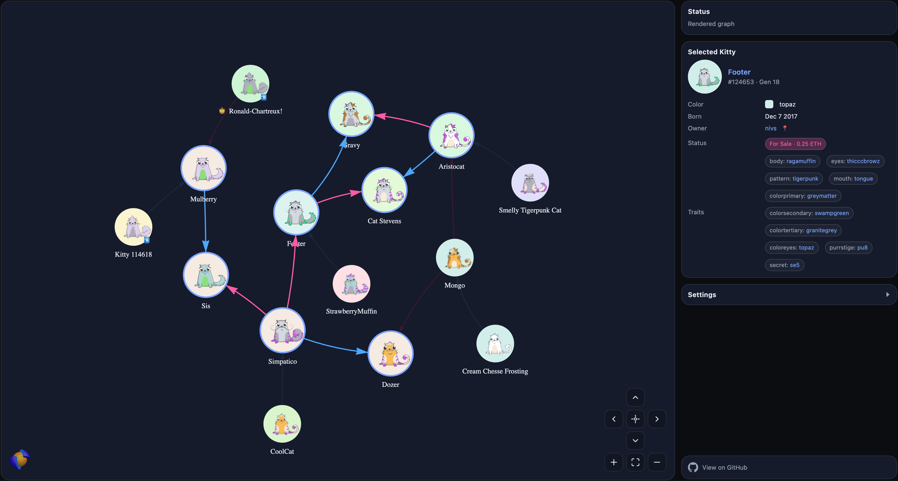

# CryptoKitties Family Graph

An interactive family graph visualizer for [CryptoKitties](https://www.cryptokitties.co/). Explore breeding relationships, discover mewtation gems, and visualize your kitty lineage.

[](https://ck.innerlogics.com/?kitties=896775,1,4,18,100000,174756,275808,500000)

**[Try the live demo →](https://ck.innerlogics.com/?kitties=896775,1,4,18,100000,174756,275808,500000)**

## Features

- **Interactive Graph**: Physics-based layout with drag, zoom, and pan
- **Family Visualization**: Pink edges for matron (mother), blue edges for sire (father)
- **Mewtation Gems**: Diamond, Gold, Silver, and Bronze gem badges for trait discoverers
- **Owner Highlighting**: Hover over owner names to highlight all their kitties (pin with highlight button or `?owner=` param)
- **Context Menu**: Right-click nodes for quick actions (expand, highlight owner, open pages, etc.)
- **Smart Expansion**: Double-click to expand family with pre-fetched accurate parent data
- **Auto-connect Discovery**: Automatically adds relatives that bridge to existing nodes when expanding
- **Smart Merging**: Loading connected kitties merges into existing graph
- **Local SVG Support**: Use locally cached SVG images for faster loading
- **Live API**: Fetch kitty data directly from CryptoKitties API
- **Embed Mode**: Embeddable graph with responsive floating panel and "Open in viewer" link

## Quick Start

1. Start a local server from the `dist` folder:
   ```bash
   cd dist && python3 -m http.server 8001
   ```

2. Open in browser:
   ```
   http://localhost:8001/
   ```

3. Load kitties by:
   - Entering kitty ID(s) in the textbox
   - Loading a JSON file
   - Using query parameters (see below)

## Query Parameters

| Parameter | Description | Example |
|-----------|-------------|---------|
| `kitty` or `kitties` | Comma-separated kitty IDs to load from API | `?kitties=124653,129868` |
| `dataUrl` | URL to a JSON file with kitty data | `?dataUrl=./my_kitties.json` |
| `svgBaseUrl` | Base URL for local SVG images | `?svgBaseUrl=./svg/` |
| `embed` | Enable embed mode (full viewport, floating panel) | `?embed=true` |
| `owner` | Pin owner highlight (address or nickname) | `?owner=0x1234...` or `?owner=nivs` |
| `noExpand` | Skip embedded parent/child extraction (faster, exact IDs only) | `?noExpand=true` |

**Examples:**
```
# Load specific kitties from API
http://localhost:8001/?kitties=124653,129868,148439

# Load from local JSON with local SVGs
http://localhost:8001/?dataUrl=./example/nivs/nivs.json&svgBaseUrl=./example/nivs/svg/

# Embed mode with specific kitties
http://localhost:8001/?embed=true&kitties=124653,129868
```

## Embedding

The graph can be embedded in other pages using an iframe with embed mode enabled.

**Embed mode features:**
- Full viewport graph (no header or sidebar)
- Floating panel for selected kitty details (draggable, collapsible, closable)
- Responsive compact mode for small viewports (panel and nav buttons shrink automatically)
- "Open in viewer" link to open current graph in standalone viewer
- Links to GitHub repo

**Basic iframe embed:**
```html
<iframe
  src="https://ck.innerlogics.com/?embed=true&kitties=124653,129868"
  width="100%"
  height="600"
  frameborder="0">
</iframe>
```

**Configuration for embeds:**
```javascript
window.CK_GRAPH_DEFAULTS = {
  // ... other options ...
  githubUrl: "https://github.com/nivs/crypto-kitties-family-graph"
};
```

## Configuration

Edit `CK_GRAPH_DEFAULTS` in `dist/index.html`:

```javascript
window.CK_GRAPH_DEFAULTS = {
  debugLevel: 0,              // 0=off, 1=info, 2=verbose
  useProxy: false,            // Enable CORS proxy for API calls
  proxyUrl: "",               // Your proxy URL (see proxy/ckproxy.php)
  svgBaseUrl: "",             // Base URL for local SVGs (probes automatically if set)
  svgFromApi: true,           // Load images from API (fallback if local not found)
  siteBaseUrl: "https://www.cryptokitties.co",
  dataUrl: "",                // Default JSON to load on startup
  githubUrl: "https://github.com/nivs/crypto-kitties-family-graph"
};
```

**Runtime Settings** (in the Settings panel):
- **Pre-fetch**: When enabled (default), fetches full details for embedded kitties. On initial load, this runs lazily in the background after the graph renders. On expand (double-click), fetches each child individually. Ensures accurate parent edges and complete owner data.
- **Auto-connect**: When enabled (default), expanding a kitty also discovers and adds relatives that would connect to existing nodes in the graph. This helps build more complete family trees automatically.

## Project Structure

```
crypto-kitties-family-graph/
├── dist/                       # Deploy this folder to web server
│   ├── index.html              # Main HTML page with embedded CSS
│   ├── js/
│   │   └── ck-family-graph.js  # Graph visualization logic
│   ├── images/                 # Logos, mewtation gem badges
│   └── example/                # Pre-generated kitty data with SVGs (most expensive, fancy cats)
├── images/                     # README assets
├── assets/                     # Source assets (not deployed)
├── proxy/                      # CORS proxy (deploy separately if needed)
└── tools/                      # Dev utils (e.g. fetch kitty data from API)
```

## Generating Kitty Data

Use `tools/ck_fetch.py` to generate a JSON file with your kitties:

```bash
# Install dependencies
pip install requests

# Fetch kitties with their parents and children (recursive mode)
python3 tools/ck_fetch.py \
  --ids "124653,129868,148439" \
  --parents 2 \
  --children 1 \
  --out my_kitties.json \
  -v

# Embedded-only mode (matches JS viewer behavior)
# Only extracts parents/children embedded in API response, no extra API calls
python3 tools/ck_fetch.py \
  --ids "1,4,18" \
  --embedded-only \
  --out founders.json \
  -v
```

**Modes:**
- **Default (recursive)**: Makes separate API calls to fetch all parents/children up to specified depth
- **`--embedded-only`**: Only extracts data embedded in each kitty's API response (faster, matches `?kitties=...` URL behavior)

See `python3 tools/ck_fetch.py --help` for all options.

## Downloading SVG Images

Use `tools/download_svgs.py` to download kitty SVG images from a JSON file:

```bash
# Basic usage
python3 tools/download_svgs.py kitties.json -o ./svg/

# Skip existing files (for incremental downloads)
python3 tools/download_svgs.py kitties.json -o ./svg/ --skip-existing

# With custom delay between requests (default: 0.5s)
python3 tools/download_svgs.py kitties.json -o ./svg/ --delay 1.0
```

**Example workflow:**
```bash
cd tools

# 1. Fetch kitty data
python3 ck_fetch.py --ids 896775 --parents 2 --children 1 \
  --out ../dist/example/dragon/dragon.json -v

# 2. Download SVGs
python3 download_svgs.py ../dist/example/dragon/dragon.json \
  -o ../dist/example/dragon/svg/ --skip-existing
```

Then load with: `?dataUrl=./example/dragon/dragon.json&svgBaseUrl=./example/dragon/svg/`

## CORS Proxy

When hosting on a web server, you may need the CORS proxy for API calls. Deploy `proxy/ckproxy.php` to your PHP-enabled server and configure `proxyUrl` in the defaults.

## Interactions

- **Click** a kitty to see details in the sidebar
- **Double-click** to expand family (fetches parents and children from API)
- **Right-click** for context menu (expand, highlight owner, open pages, copy ID, etc.)
- **Hover** over a kitty to highlight family connections (edges dim for non-family)
- **Hover** over owner name to highlight all their kitties in the graph
- **Pin** owner highlight by clicking the user icon button (persists while navigating)
- **Drag** nodes to rearrange
- **Toggle Physics** to freeze/unfreeze the layout

## Example Graphs

Notable kitties that make interesting demo graphs:

| Kitty | ID | Description |
|-------|-----|-------------|
| Dragon | 896775 | Sold for 600 ETH (~$170k at the time) - the most expensive CryptoKitty ever |
| Genesis | 1 | The first CryptoKitty ever created |
| Founder Cat #4 | 4 | Gen 0 founder cat from the early days |
| Founder Cat #18 | 18 | Gen 0 founder cat from the early days |
| Kitty #100,000 | 100000 | The 100,000th kitty - ecosystem milestone |
| Cathena | 500000 | Exclusive special edition kitty |
| First Mistletoe | 174756 | First holiday Fancy cat (Christmas 2017) |
| First SantaClaws | 275808 | First SantaClaws Fancy cat |

### Live Demo Links

Try these examples on [ck.innerlogics.com](https://ck.innerlogics.com):

- [Dragon](https://ck.innerlogics.com/?kitties=896775) - sold for 600 ETH (~$170k)
- [Founders](https://ck.innerlogics.com/?kitties=1,4,18) - Genesis + early Gen 0 cats
- [Milestones](https://ck.innerlogics.com/?kitties=100000,500000) - 100k and 500k kitties
- [Holiday Fancies](https://ck.innerlogics.com/?kitties=174756,275808) - First Mistletoe & SantaClaws
- [All-in showcase](https://ck.innerlogics.com/?kitties=896775,1,4,18,100000,174756,275808,500000) - all notable kitties
- [Embed mode](https://ck.innerlogics.com/?embed=true&dataUrl=./example/nivs/nivs.json&svgBaseUrl=./example/nivs/svg/&owner=nivs) - with owner highlight pinned

**Quick-start presets** (paste into the Kitty ID field or use as `?kitties=...`):

| Preset | IDs |
|--------|-----|
| Most expensive | `896775` |
| Origin story | `1,4,18` |
| Milestones | `100000,500000` |
| Holiday Fancies | `174756,275808` |
| All-in showcase | `896775,1,4,18,100000,174756,275808,500000` |

### Generating Example Data

From the `tools/` folder:

**Dragon (most expensive):**
```bash
python3 ck_fetch.py --ids 896775 --parents 1 --children 0 -v \
  --out ../dist/example/dragon/dragon.json
python3 download_svgs.py ../dist/example/dragon/dragon.json \
  -o ../dist/example/dragon/svg/ --skip-existing
```
- [Live (API)](https://ck.innerlogics.com/?kitties=896775) ・ [Live (cached JSON+SVGs)](https://ck.innerlogics.com/?dataUrl=./example/dragon/dragon.json&svgBaseUrl=./example/dragon/svg/)
- Local test:
  - API: `http://localhost:8001/?kitties=896775`
  - JSON: `http://localhost:8001/?dataUrl=./example/dragon/dragon.json&svgBaseUrl=./example/dragon/svg/`

**Founders (origin story):**
```bash
python3 ck_fetch.py --ids "1,4,18" --embedded-only -v \
  --out ../dist/example/founders/founders.json
python3 download_svgs.py ../dist/example/founders/founders.json \
  -o ../dist/example/founders/svg/ --skip-existing
```
- [Live (API)](https://ck.innerlogics.com/?kitties=1,4,18) ・ [Live (cached JSON+SVGs)](https://ck.innerlogics.com/?dataUrl=./example/founders/founders.json&svgBaseUrl=./example/founders/svg/)
- Local test:
  - API: `http://localhost:8001/?kitties=1,4,18`
  - JSON: `http://localhost:8001/?dataUrl=./example/founders/founders.json&svgBaseUrl=./example/founders/svg/`

**Milestones:**
```bash
python3 ck_fetch.py --ids "100000,500000" --parents 1 --children 1 --embedded-only -v \
  --out ../dist/example/milestones/milestones.json
python3 download_svgs.py ../dist/example/milestones/milestones.json \
  -o ../dist/example/milestones/svg/ --skip-existing
```
- [Live (API)](https://ck.innerlogics.com/?kitties=100000,500000) ・ [Live (cached JSON+SVGs)](https://ck.innerlogics.com/?dataUrl=./example/milestones/milestones.json&svgBaseUrl=./example/milestones/svg/)
- Local test:
  - API: `http://localhost:8001/?kitties=100000,500000`
  - JSON: `http://localhost:8001/?dataUrl=./example/milestones/milestones.json&svgBaseUrl=./example/milestones/svg/`

**Holiday Fancies:**
```bash
python3 ck_fetch.py --ids "174756,275808" --embedded-only -v \
  --out ../dist/example/holidays/holidays.json
python3 download_svgs.py ../dist/example/holidays/holidays.json \
  -o ../dist/example/holidays/svg/ --skip-existing
```
- [Live (API)](https://ck.innerlogics.com/?kitties=174756,275808) ・ [Live (cached JSON+SVGs)](https://ck.innerlogics.com/?dataUrl=./example/holidays/holidays.json&svgBaseUrl=./example/holidays/svg/)
- Local test:
  - API: `http://localhost:8001/?kitties=174756,275808`
  - JSON: `http://localhost:8001/?dataUrl=./example/holidays/holidays.json&svgBaseUrl=./example/holidays/svg/`

## Screen Recording


## License

MIT License - see [LICENSE](LICENSE)

## Credits

- [CryptoKitties](https://www.cryptokitties.co/) for the awesome game and API
- [vis-network](https://visjs.github.io/vis-network/docs/network/) for the graph library

