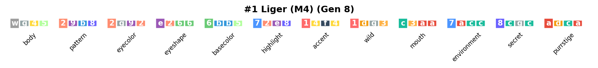
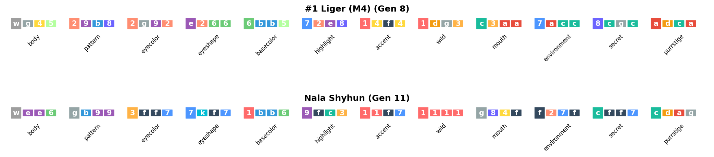
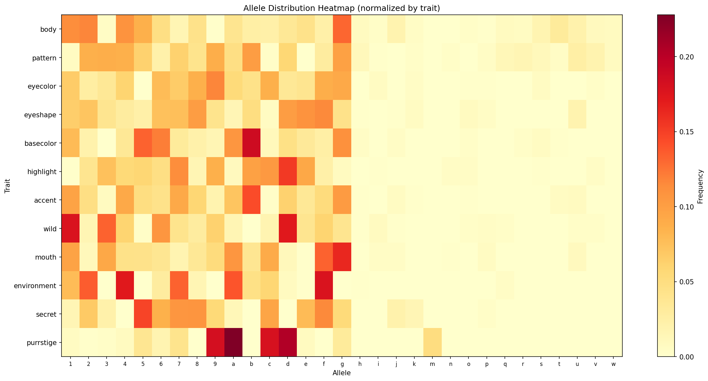
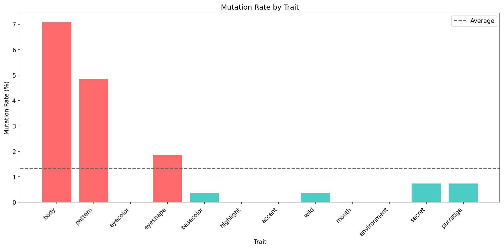

# CryptoKitties Family Graph Tools

Python utilities for fetching, analyzing, and visualizing CryptoKitties genetic data.

## Setup

```bash
cd tools
python3 -m venv .venv
source .venv/bin/activate
pip install requests matplotlib numpy
```

## Tools Overview

| Tool | Description |
|------|-------------|
| `ck_fetch.py` | Fetch kitty data from CryptoKitties API |
| `download_svgs.py` | Download kitty SVG/PNG images |
| `gene_analysis.py` | Analyze genetic inheritance and mewtations |
| `genome_visualizer.py` | Create visual genome charts |
| `prune_to_ancestors.py` | Prune JSON to direct ancestors only |
| `fancy_detector.py` | Detect fancy cats and potential matches |
| `find_rare_traits.py` | Search API for rare trait kitties (Tier II-IIII) |
| `ck_traits.py` | Trait name mappings and mewtation tier data |
| `filter_connected.py` | Filter dataset to connected nodes only |
| `prune_json.py` | Reduce JSON file size by removing unused fields |
| **Documentation Tools** | |
| `generate_examples_md.py` | Generate docs/EXAMPLES.md from config |
| `sync_examples_config.py` | Sync config with actual JSON files |
| `update_examples.sh` | Run both sync and generate (unified workflow) |

> **Example Datasets:** See [docs/EXAMPLE_GENERATION.md](../docs/EXAMPLE_GENERATION.md) for commands to generate all example datasets.

---

## ck_fetch.py

Fetch kitty data from the CryptoKitties public API and save as JSON.

### Usage

```bash
# Fetch specific kitties
python3 ck_fetch.py --ids "1,4,18" --out founders.json

# Fetch from file of IDs
python3 ck_fetch.py --ids-file kitty_ids.txt --out collection.json

# Include parents and children
python3 ck_fetch.py --ids "124653" --parents 3 --children 1 --out family.json

# Embedded data only (faster, no extra API calls)
python3 ck_fetch.py --ids "1,4,18" --parents 0 --children 1 --embedded-only --out data.json
```

### Options

- `--ids` / `--ids-file`: Kitty IDs to fetch (comma-separated or file)
- `--parents N`: Fetch N levels of ancestors (default: 0)
- `--children N`: Fetch N levels of children (default: 0)
- `--embedded-only`: Only use embedded data, skip extra API calls
- `--out FILE`: Output JSON file path
- `-v` / `-vv`: Verbose output

---

## download_svgs.py

Download kitty images (SVG or PNG) from a JSON file.

### Usage

```bash
# Download all images
python3 download_svgs.py collection.json -o ./images/

# Skip already downloaded
python3 download_svgs.py collection.json -o ./images/ --skip-existing
```

---

## gene_analysis.py

Analyze CryptoKitties genetic data including inheritance patterns, mutations, diversity, and mewtation distribution.

### Usage

```bash
# Run all analyses
python3 gene_analysis.py kitties.json --all

# Trace a specific kitty's ancestry
python3 gene_analysis.py kitties.json --trace 124653

# Analyze mewtation distribution
python3 gene_analysis.py kitties.json --mewtations

# Analyze genetic diversity
python3 gene_analysis.py kitties.json --diversity
```

### Example Output: Genome Trace

```
$ python3 gene_analysis.py ../dist/examples/tier_iiii/tier_iiii.json --trace 1098467

Loaded 158 kitties from ../dist/examples/tier_iiii/tier_iiii.json
Root IDs: [1098467, 1099023, 1099479, 1099487, 1099579, ...]
Generations: 1 to 4848

=== ANCESTRY TRACE: #1098467 ===

=== Kitty #1098467 (#1 Liger (M4)) ===
Generation: 8
Parents: matron=1097922, sire=1098391

Genes (decimal): 516568347590239923453068140776087538308342224181216206851875558908890622
Genes (kai):     acdacgc8cca7aa3c3gd14f418e275bb6662e29g28b9254gw

Decoded traits (d=dominant, r1/r2/r3=recessive):
--------------------------------------------------------------------------------
Category       D      R1     R2     R3    Dominant Trait (Tier)
--------------------------------------------------------------------------------
  body           w      g      4      5     liger (IIII)
  pattern        2      9      b      8     tiger
  eyecolor       2      g      9      2     gold
  eyeshape       e      2      6      6     slyboots
  basecolor      6      b      b      5     mauveover
  highlight      7      2      e      8     royalpurple
  accent         1      4      f      4     belleblue
  wild           1      d      g      3     ?
  mouth          c      3      a      a     grim
  environment    7      a      c      c     ?
  secret         8      c      g      c     ?
  purrstige      a      d      c      a     ?
--------------------------------------------------------------------------------
Mewtations in dominant genes: 1/12
```

### Example Output: Mewtation Analysis

```
$ python3 gene_analysis.py ../dist/examples/tier_iiii/tier_iiii.json --mewtations

Loaded 158 kitties from ../dist/examples/tier_iiii/tier_iiii.json
Generations: 1 to 4848

=== MEWTATION ANALYSIS ===

Analyzed 158 kitties

DOMINANT ALLELE TIER DISTRIBUTION:
------------------------------------------------------------
Tier          Count Description
------------------------------------------------------------
base           1648   Base traits (Kai 1-g)
I               103   Tier I mewtations (Kai h-p)
II               68   Tier II mewtations (Kai q-t)
III              67   Tier III mewtations (Kai u-v)
IIII             10   Tier IIII mewtations (Kai w) - rarest


TOP KITTIES BY MEWTATION COUNT:
----------------------------------------------------------------------
  Kitty ID Name                  Gen  Mewts Top Mewtation
----------------------------------------------------------------------
    935776 Zaki Ahemdeedee         6      5   eyeshape: bornwithit (III)
    935550 Bala Waddlegah          5      4   eyeshape: bornwithit (III)
   1060647 Daiki Proudfluff        6      4   body: lykoi (III)
   1158641 Bao Vileshmoops         8      4   pattern: gyre (III)
   1098689 Catua Daintywow         8      4   body: toyger (II)


MEWTATION COUNT BY TRAIT AND TIER:
----------------------------------------------------------------------
Trait               I       II      III     IIII
----------------------------------------------------------------------
body               20       35       19        5
pattern             7       25       27        5
eyecolor            3        0        2        0
eyeshape           11        0        7        0
basecolor           4        3        0        0
highlight           5        1        2        0
accent              6        1        4        0
wild                9        0        2        0
mouth               3        0        4        0
environment         1        3        0        0
secret             18        0        0        0
purrstige          16        0        0        0
```

### Example Output: Inheritance Analysis

```
$ python3 gene_analysis.py ../dist/examples/nivs/nivs_full_parents.json --mutations

Loaded 878 kitties
Generations: 0 to 22

=== INHERITANCE ANALYSIS ===

Analyzed 646 kitties with both parents in dataset

INHERITANCE RATES BY TRAIT:
------------------------------------------------------------
Trait        From Parents    Mutations  Mutation Rate
------------------------------------------------------------
body                 1797           10          0.55%
pattern              1789           27          1.49%
eyecolor             1881           17          0.90%
eyeshape             1686           45          2.60%
basecolor            1949           21          1.07%
highlight            1953            9          0.46%
accent               1300            8          0.61%
wild                 1513            0          0.00%
mouth                1785           34          1.87%
environment          1945            0          0.00%
secret               1791           41          2.24%
purrstige            1628           18          1.09%
------------------------------------------------------------
TOTAL               21017          230          1.08%

=== MUTATION EVENTS (10 of 230) ===

Kitty #3002 (Gen 1)
  Trait: eyeshape
  Child allele: 'k' (not in parents)
  Matron alleles: {'6', '8'}
  Sire alleles: {'7', '8'}
```

---

## genome_visualizer.py

Create visual genome charts showing allele distributions, inheritance diagrams, and mutation heatmaps.

### Usage

```bash
# Show genome strip for a kitty (requires matplotlib)
python3 genome_visualizer.py kitties.json --strip 1 -o genome.png

# ASCII mode (no matplotlib required)
python3 genome_visualizer.py kitties.json --strip 1 --ascii

# Compare two kitties
python3 genome_visualizer.py kitties.json --compare 1 4

# Show inheritance diagram (child + parents)
python3 genome_visualizer.py kitties.json --inheritance 124653

# Allele diversity heatmap
python3 genome_visualizer.py kitties.json --heatmap -o heatmap.png

# Mutation rate chart
python3 genome_visualizer.py kitties.json --mutations -o mutations.png
```

### Example Output (ASCII mode)

```
$ python3 genome_visualizer.py ../dist/examples/founders/founders.json --strip 1 --ascii

======================================================================
  Genesis (Gen 0)
======================================================================
  Genes: ccac7787fa7fafaa16467755...

  Trait         D   R1  R2  R3   (D=dominant, R=recessive)
  --------------------------------------------------
  body          [e]  d   e   e
  pattern       [c]  c   c   c
  eyecolor      [6]  6   3   7
  eyeshape      [6]  6   7   6
  basecolor     [4]  4   4   4
  highlight     [e]  e   9   f
  accent        [5]  5   7   7
  wild          [6]  4   6   1
  mouth         [a]  a   f   a
  environment   [f]  7   a   f
  secret        [7]  8   7   7
  purrstige     [c]  a   c   c
```

### Example Images

**Genome Strip** - Shows all 48 genes grouped by trait (dominant allele highlighted):


*Kitty #1098467 with Tier IIII liger body trait*

**Genome Comparison** - Side-by-side comparison of two kitties:


*Two liger kitties showing shared and different alleles*

**Inheritance Diagram** - Shows how a child inherited alleles from parents:


**Allele Heatmap** - Distribution of alleles across all traits in a collection:


*Note the rare 'w' alleles (Tier IIII) in body and pattern traits*

**Mutation Rate Chart** - Mutation frequency by trait:



---

## prune_to_ancestors.py

Prune a JSON file to include only direct ancestors of specified kitties.

### Usage

```bash
# Keep only ancestors of kitty 124653
python3 prune_to_ancestors.py full_data.json --root 124653 -o ancestors.json

# Matron line only
python3 prune_to_ancestors.py full_data.json --root 124653 --matron-only -o matron_line.json
```

---

## fancy_detector.py

Detect fancy cats, exclusives, and special editions in a kitty collection.

### Usage

```bash
# Basic analysis
python3 fancy_detector.py kitties.json

# With detailed output
python3 fancy_detector.py kitties.json --verbose

# Check for kitties close to matching fancy recipes
python3 fancy_detector.py kitties.json --check-potential
```

### Example Output

```
$ python3 fancy_detector.py ../dist/examples/founders/founders.json

Loaded 10 kitties from ../dist/examples/founders/founders.json

=== FANCY CAT ANALYSIS ===

EXCLUSIVE CATS (1):
--------------------------------------------------
  #      1  Genesis                   Gen 0

FANCY CATS (2):
--------------------------------------------------
  #      1  Genesis                   Genesis         Gen 0
  # 121126  unnamed                   DuCat           Gen 12

SUMMARY: 1 exclusives, 2 fancies, 0 special editions
```

### Example Output: Potential Matches

```
$ python3 fancy_detector.py kitties.json --check-potential

=== POTENTIAL FANCY MATCHES (407) ===

Kitties that are close to matching a fancy recipe:

  #   3679  Gen 5 / Brisk         → ducat
           Matches 3/4 traits. Missing: basecolor=cottoncandy (has: greymatter)

  #   1003  Boots                 → ship_cat
           Matches 3/4 traits. Missing: pattern=luckystripe (has: totesbasic)
```

---

## find_rare_traits.py

Search the CryptoKitties API for kitties with rare mewtation traits.

### Usage

```bash
# Find Tier IIII kitties (rarest mewtations)
python3 find_rare_traits.py --tier IIII --limit 10

# Find Tier III kitties
python3 find_rare_traits.py --tier III --limit 10

# Search for a specific trait
python3 find_rare_traits.py --trait liger --limit 5

# Find diamond gem kitties (first discoverers)
python3 find_rare_traits.py --diamonds --limit 5

# Save IDs for use with ck_fetch.py
python3 find_rare_traits.py --tier IIII --limit 10 --ids-file tier_iiii_ids.txt
python3 ck_fetch.py --ids-file tier_iiii_ids.txt --parents 3 --out tier_iiii.json
```

### Options

- `--tier {II,III,IIII}`: Find kitties with traits of this mewtation tier
- `--trait NAME`: Search for a specific trait value (e.g., `liger`, `moonrise`)
- `--diamonds`: Find kitties with diamond mewtation gems (first discoverers)
- `--limit N`: Maximum results (default: 10)
- `--ids-file FILE`: Save IDs to file for use with `ck_fetch.py --ids-file`
- `--output FILE`: Save full results to JSON file

---

## ck_traits.py

Data module containing CryptoKitties trait mappings and mewtation tier information.

### Usage in Python

```python
from ck_traits import (
    get_mewtation_tier,
    get_trait_name,
    TRAIT_CATEGORIES,
    KAI
)

# Get mewtation tier for a Kai character
tier = get_mewtation_tier('h')  # Returns 'I'
tier = get_mewtation_tier('w')  # Returns 'IIII'

# Get trait name
name = get_trait_name(0, 'h')   # Returns 'norwegianforest' (body category)
```

### Mewtation Tiers

| Tier | Kai Characters | Decimal Range |
|------|---------------|---------------|
| base | 1-g | 0-15 |
| I | h-p | 16-23 |
| II | q-t | 24-27 |
| III | u-v | 28-29 |
| IIII | w | 30 |

> Note: Kai `x` (31) is impossible to reach via mutation.

### Trait Categories

1. body (FU)
2. pattern (PA)
3. eyecolor (EC)
4. eyeshape (ES)
5. basecolor (BC)
6. highlight (HC)
7. accent (AC)
8. wild (WE)
9. mouth (MO)
10. environment (EN)
11. secret (SE)
12. purrstige (PU)

---

## CryptoKitties Genome Structure

Each kitty has a 256-bit genome consisting of:
- 48 genes (each 5 bits = values 0-31)
- 12 trait categories
- 4 genes per trait: **d** (dominant/expressed), **r1**, **r2**, **r3** (recessive)

Genes are encoded in **Kai notation**: `123456789abcdefghijkmnopqrstuvwx`

### Mutation Formula

Mewtations occur when breeding two adjacent base traits:
```
mutation_gene = (gene1 / 2) + 16
```

Example: Breeding `savannah` (1) + `selkirk` (2) can produce `norwegianforest` (h).

---

## Documentation Tools

### update_examples.sh

Unified workflow script to sync configuration and regenerate documentation.

**Usage:**
```bash
# Scan for changes and update
./update_examples.sh

# Also remove config entries for deleted files
./update_examples.sh --remove-missing
```

**What it does:**
1. Runs `sync_examples_config.py` in dry-run mode to detect changes
2. Warns and prompts for confirmation if changes detected
3. Updates `examples_config.json` with new/removed files
4. Regenerates `docs/EXAMPLES.md` from updated config

**When to use:**
- After adding new JSON files to `dist/examples/`
- After removing example datasets
- To ensure documentation is up to date

---

### generate_examples_md.py

Generates `docs/EXAMPLES.md` from `examples_config.json`.

**Usage:**
```bash
python3 generate_examples_md.py
```

**Output:**
- Creates `docs/EXAMPLES.md` with links to live website
- Each example includes base link and variations
- Organized by sections with table of contents

**Note:** Normally you'd use `update_examples.sh` instead of calling this directly.

---

### sync_examples_config.py

Scans `dist/examples/` for JSON files and syncs with configuration.

**Usage:**
```bash
# Scan and add missing files
python3 sync_examples_config.py

# Also remove config entries for files that no longer exist
python3 sync_examples_config.py --remove-missing

# Preview changes without modifying config
python3 sync_examples_config.py --dry-run
```

**What it does:**
- Discovers new JSON files and adds to config with default metadata
- Optionally removes config entries for deleted files
- New files added as variations to existing examples (same directory)
- Creates new example groups for new directories

**After running:** Manually edit `examples_config.json` to:
- Update variation labels (changes `"View (filename.json)"` to meaningful text)
- Add descriptions for new examples
- Add URL parameters for specific views
- Reorganize sections if needed

**Note:** Normally you'd use `update_examples.sh` instead of calling this directly.

---

## Credits

The genomics information in these tools is based on community reverse engineering work:

| Researcher | Contribution |
|------------|--------------|
| **Kai Turner** | First to decode the 5-bit gene structure (Dec 2017) |
| **Sean Soria** | Reverse engineered the mixGenes breeding algorithm (Dec 2017) |
| **Alex Hegyi** | Python implementation of gene science (Dec 2017) |
| **Gerald Bauer** | Comprehensive documentation in the [cryptocopycats](https://github.com/cryptocopycats) repositories |

### Source Repositories (Public Domain)

- [kittypedia](https://github.com/cryptocopycats/kittypedia) - Encyclopedia of traits, timelines, statistics
- [programming-cryptokitties](https://github.com/cryptocopycats/programming-cryptokitties) - Step-by-step code tutorials
- [cryptokitties](https://github.com/cryptocopycats/cryptokitties) - Overview, history, contract analysis
